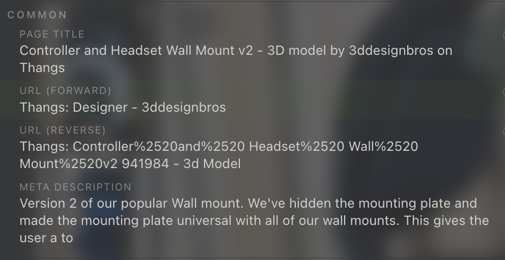

<!-- 
# Organize my legacy planning notes for markdown_linker
* Today I want to resume working on `markdown_linker/markdown_linker.user.js.md`
* I was reading through my legacy planning notes, but am having a hard time figuring out what is done, what is not. 
  * These notes also contain "ideas" which are just thoughts from my mind that I write down until I can re-write them into more detailed prompts which are then fed into a planning agent.
  * If checkmark list items are marked with an X, they are complete
  * If any markdown is commented out that means it is complete, however the inverse is not always true (some uncommented items might actually be completed already)
* You'll need to re-read the code under:
  * `docs/ai/GUIDE.md`
  * `markdown_linker/**/*`
  * `common/**/*`
* Please read (not write) these files then compare against the current state of the code:
  * `docs/.ai/planning/markdown_linker/legacy_planning/markdown_linker.user.js`
  * `docs/.ai/planning/markdown_linker/legacy_planning/markdown_linker.user.js.md`
* Then produce two new documents to organize the content from those two files:
  * `docs/.ai/planning/markdown_linker/legacy_planning/LEGACY_PLANNING_COMPLETED.md`
  * `docs/.ai/planning/markdown_linker/legacy_planning/LEGACY_PLANNING_ROADMAP.md`
    * Include unimplemented tasks and ideas here
    * Organize how ever you think it will be effiecient for implementing

 -->

---

<!-- 
# New link formats for "common" section

* Currenty the popup menu has a "common" section which contains 4 link format style:
  * 
  * image:   
  * image: 
  * image: 
  * image: 
  * image: 
* [▷ Markdown Links Syntax - Tutorial](https://htmlmarkdown.com/syntax/markdown-links/) 

-->

# Redefine the formats and variants of link.title

* `[${url.hostname}: $(extractPageTitle)](${url})`

# Screenshots of Current Link Titles
*  
* 
* 
* 
* 

## title format rules

* Avoid using `[`, `]`, `(`, `)` in the link titles.

!!! info 
    We are building a `markdown` link which uses `[`, `]`, `(`, `)` in the syntax. 
    Some IDEs, renderers, services, etc... can become confused while trying to parse such links

## Common (across all domains)

## Unique (per domain) - aka "Domain Specific"
* Domain specific computation (of link.title) is currently supported only for a few domains.
  * I believe it's `amazon.com` and `youtube.com` 
  * There are many more that I'd like to add
  * Up until now
* In order to better support domain specific link.title formatting, I think we need to figure out how to express those rules using something like JSON5 files. 

### github .com
* [[HSD-17570] Reset reconnect backoff sooner: tune V3 MQTT auto-reconnect config by zakkhoyt · Pull Request #2794 · hatch-baby/mobile](https://github.com/hatch-baby/mobile/pull/2794)

### apple docs
* [tryMap(_:) | Apple Developer Documentation](https://developer.apple.com/documentation/combine/publisher/trymap(_:))

