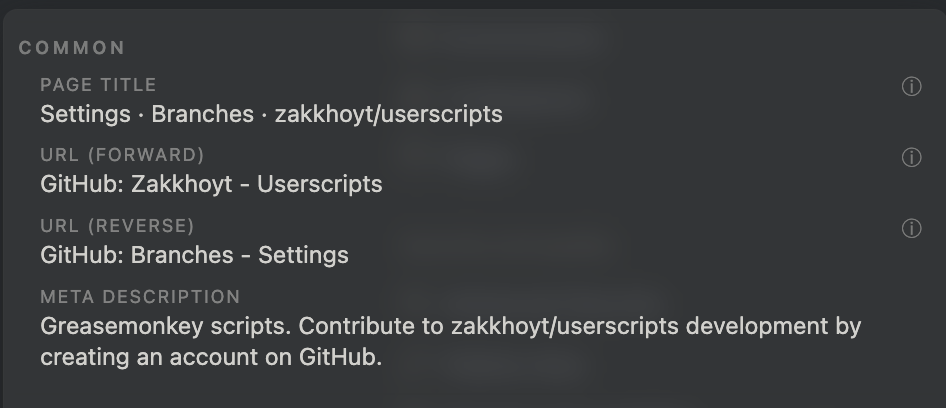

---

<!-- # Redefine the formats and variants of link.title -->
# Add a new option to link title formatting

The current options for `common` link title formats are (not sure what they are called in code)
* page title
* url forwared
* url reverse
* meta description

I want us to add a new / additional format. We can call it `domain based` or something like that

## Popup 
Meaning a new entry to this popup section

 

## Format Syntax

* `[${url.hostname}: $(extractPageTitle)](${url})`

## Examples (common)

# Screenshots of Current Link Titles
*  
* 
* 
* 
* 

## title format rules

* Avoid using `[`, `]`, `(`, `)` in the link titles.

!!! info 
    We are building a `markdown` link which uses `[`, `]`, `(`, `)` in the syntax. 
    Some IDEs, renderers, services, etc... can become confused while trying to parse such links

## Common (across all domains)

## Unique (per domain) - aka "Domain Specific"
* Domain specific computation (of link.title) is currently supported only for a few domains.
  * I believe it's `amazon.com` and `youtube.com` 
  * There are many more that I'd like to add
  * Up until now
* In order to better support domain specific link.title formatting, I think we need to figure out how to express those rules using something like JSON5 files. 

### github .com
* [[HSD-17570] Reset reconnect backoff sooner: tune V3 MQTT auto-reconnect config by zakkhoyt · Pull Request #2794 · hatch-baby/mobile](https://github.com/hatch-baby/mobile/pull/2794)

### apple docs
* [tryMap(_:) | Apple Developer Documentation](https://developer.apple.com/documentation/combine/publisher/trymap(_:))

