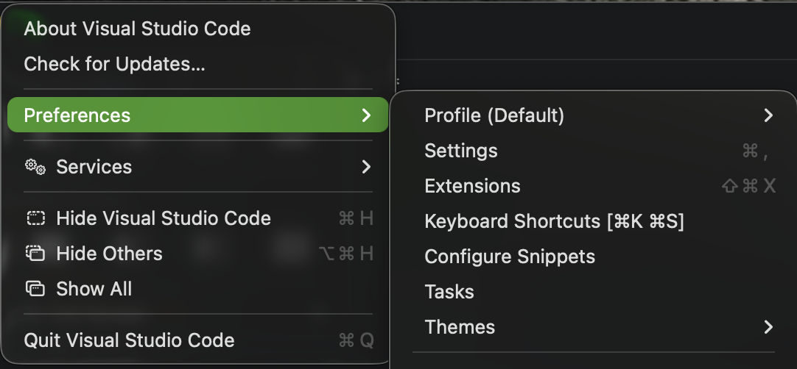

<!-- 

# Shortcuts - Detect collisions with other shortcuts?
* When defining custom shortcuts I find that many are already taken by some other function in the browser or macOS
* Is it possible for our userscript to read back all shortcuts that are supported throughout the browser? 
* Is it possible for our userscript to read back all shortcuts that are supported throughout the macOS?
* I'm guessing the answer is no, but it would be great if it could tell the user that their custom shortcut is already in use 

* Could the script use this list of macOS shortcuts `[Mac keyboard shortcuts - Apple Support](https://support.apple.com/en-us/102650)` as a list of "used" shortcuts? I'm not sure if I have some of those disabled, or if they can be disabled.
  * I'm guessing the script cant' know if those keystrokes are disabled


# Shortcuts - Possible support for additional triggers
* Currently shortcuts can listent to the common modifier keys, normal keys, and clicks. however there are a couple things that i'd like to include if possible

## macOS function / `fn / `🌐` key
* Can we observer the `fn` key events too? '
* I'd like to use `fn` like another modifier key
* `fn` is in the lower left (easy to reach)
* `fn` is under-utilized across the OS IMO

## esc key
* I assume we can monitor `esc` events as it seems to cancel the shortcut recording in the settings screen
* Is it possible to require that listener to  respond to three sequential presses of esc or somethign like that?

## Multiple presses of keys
Here are some examples I'm picturing
* press `opt` 3 times (that's the full shortcut)
  * opt (keydown) opt (keyup) opt (keydown) opt (keyup)opt (keydown) opt (keyup)
* press `opt` 3 times, holding on the last keydown, then click
  * opt (keydown) opt (keyup) opt (keydown) opt (keyup)opt (keydown) mouse down

!!! info
    This likely fits right into the [support-for-keyboard-shortcut-chords](#support-for-keyboard-shortcut-chords) section below

## Additional Mouse Triggers

### Double Click
* Can we receive a double click event in our script and then use it as a shortcut event? 
* how to represent that graphically?
* How about triple/quad clicks?


### Right Click
* `Right click` in a browser is pretty much reserverd for showing the browser's context menu, however...
* If the script can detect that event and then intercept it (do it doesn't make it to the browser), then we could use it as a shortcut trigger. 
  * EX: `opt + right click`

### Double Right Click
* Is this a thing we can support?

### Trackpad Events
* Apple's trackpads are great at tracking multiple touches/fingers. 
* Is the number of fingers down available to our script? 
* Some ideas:
* `2 fingers down` (one in the left most 1/4 of the width, one in the right most 1/4 of the width)
* WE can work out details on this later, if it's even possible. I want you to research it. 


## Support for Chords
* In the context of Keyboard Shortcuts, there is the concept of a `chord`  where multiple `key combos` are strung together. 
* A `chord` can be made up of 1 or more `terms` (where each term is typical `key combo`)

*References*
See my notes on keyboards & keyboard shortcuts
* `docs/.ai/planning/markdown_linker/planning_references/notes/keyboards/**/*`
* `docs/.ai/planning/markdown_linker/planning_references/notes/keyboards/MACOS_KEYBOARD_SHORTCUTS.md` discussed `chords`


* Chords notation look like normal `key combos` placed inside of `[` and `]`

* Here is a screenshot of menus from VSCode: <br>

* Chords are handy for:
  * Apps that have a support a lot of different shortcuts (IE: a browser where our userscript is running)
  * Overloading a `key combo` to do multiple different actions (if you consider the last term to be overloaded)
    * EX: Suppose you really like to use `cmd s` for things
      * This is typically reserved for saving: `cmd s`

* I like to think of it like this: The first `key combo` behaves more like a `modifier key`, providing context for the next `key combo`
* Picture a tree graph. Each `term` in a chord would make the tree taller 

* Visual Studio Code makes heavy use of chords.
  * The build in shortcuts end to use `cmd k` for the initial `key combo` in the chord


# Action Items
* I'd like you to research and draft a document about EXPANDED_KEYBOARD_SHORTCUTS
* Use the claude skill `/write-markdown` (`~/.claude/skills/write-markdown/`) to research and draft a document: `~/conductor/workspaces/userscripts/albuquerque/docs/.ai/planning/markdown_linker/shortcuts/EXPANDED_KEYBOARD_SHORTCUTS.md` to address all ideas above. summarize in chat
* Include an H1 section (with nested subsections) about each topic above
  * at the top of the section: summarize my question with light contexgt
  * at the top of the section: A succinct/direct answer
  * Then can add details after. I just want to able to read thorugh it to find answers 
-->


---

<!-- 
* Could the script use this list of macOS shortcuts `[Mac keyboard shortcuts - Apple Support](https://support.apple.com/en-us/102650)` as a list of "used" shortcuts? I'm not sure if I have some of those disabled, or if they can be disabled.
  * I'm guessing the script cant' know if those keystrokes are disabled


## Additional Mouse Triggers

### Double Click
* Can we receive a double click event in our script and then use it as a shortcut event? 
* how to represent that graphically?
* How about triple/quad clicks?


### Right Click
* `Right click` in a browser is pretty much reserverd for showing the browser's context menu, however...
* If the script can detect that event and then intercept it (do it doesn't make it to the browser), then we could use it as a shortcut trigger. 
  * EX: `opt + right click`

### Double Right Click
* Is this a thing we can support?

### Trackpad Events
* Apple's trackpads are great at tracking multiple touches/fingers. 
* Is the number of fingers down available to our script? 
* Some ideas:
* `2 fingers down` (one in the left most 1/4 of the width, one in the right most 1/4 of the width)
* WE can work out details on this later, if it's even possible. I want you to research it. 


---


# Show Settings UI - Shortcut support

* Just like the existing keyboard shortcut settings & UI:
* Add a new shortcut + preference, and settings UI control that will itself open the settings UI (if not already open)

 -->
<!-- 
## Feedback

* Was able to record a simple shortcut for the new `toggle settings UI` function
* Chords sort of work.... The recording
* `opt (down), opt (up), cmd (down), cmd (up), v (down), v (up)` registers the same as `opt (down), cmd (down), v (down), all (up)`
  * and that's `⌘ + ⌥ + V`
  * That's not chords that's just a shortcut (one term)

* I can't record someting like `opt+z opt+v` because the recording stops on `z (up)`
  * Fix this but also be sure that I can still register `opt+z`. You said you were going ot use some timeout?
* I can't record shortcuts tthat include > 1 click because the first click ends the recording
* I can't record shortcuts that use right clicks because the broswer's context menu pops up even though the settings window is open and recording

* How did youre tests even pass? Did they try any of this stuff? Seems like they DEF should have caught some of these problems


### Shortcut Notation
* Term (aka shortcut): 
  * EX: `⌘+k`
* Chords: 
  * One ore more `terms` joined with ` ` (space)
    * EX: `[⌘+k ⌘+s]`
  * If `terms.count >= 2` then wrap in `[` `]`, otherwise leave them off
    * EX: `[⌘+k ⌘+s]` Wrapped in square brackets because `terms.count >= 2`
    * EX: `⌘+k` No square brackets because `!terms.count >= 2`  
  * Use the mac glyphs where ever possible
* Please implement this notation when displaying shortcuts in the settings UI
 -->
* 


---


# No glyph for `space` (or you are using a literal `  `)
# Shortcut recording is still ended with a single `esc` press


<!--  
# `Buffer links (hold + click)` bug
* Seems like this shortcut REQUIRES a click (or N clicks, or N right clicks, etc..) as the final event of the last term
* I can record a shortcut that has no click in it (such as `⌘+⌥+Z`), but that shortcut doesn't actually do anything 
  * When I try this wiht `⌘+⌥+Z`, no capturing is triggered (no green animation on `Z` down, no green popup in the upper right on all keys up)
* It seems like it we **should** be able to make the last event operate like it does when it IS a click and that should work
  * EX: `⌘+⌥+Z` is a single term (or chord count of 1)
    * I would think as the final key/mouse goes to the `down` state (assuming all the others key/mouse are also in the `down` state) that this would act as a the trigger (much like the `click` / `mouse down` event currently does)
        * IE capture what's under the cursor and its tot the capture buffer
        * Subsequent key/mouse `down` events would trigger another capture (much like the `click` / `mouse down` event currently does) and add it to the capture buffer
        * Subsequent key/mouse `up` -> `down` events of that same "final" key/mouse would trigger further captures (assuming that all of the other key/mouse items in the terms continue to be in the `down` state) that this will trigger additional captures to the buffer.
        * When any of the key/mouse items (excluding the "final" item) emit an `up` event, this triggers the the capture buffer to finalize (convert the captured info in the output markdown, copy to clipboard etc...
      * This is how the current code works after all ( consider `⌘+⌥+click`), almost
        * Except the current code expects the `click` to be the final `down` event.
          * EX: `⌥+Z+click` requires the click to be the final down event, and the recorder forces the click to be the last key/mouse item in the term
          * YSK that `Quiet copy (no menu)` works the way I described above, (except that modifier keys can't be act as the trigger, which I guess is fair) 
            * Given the shortcut `⌥+Z+A` 
            * Any of the  `Z`, `A` can operate as the trigger so long as the others are already in the `down` state as it goes to the `down` state as well. 
              * `⌥` down -> `Z down` -> `A` down -> A is the trigger
              * `Z down` -> `A` down -> `⌥` down ->  `⌥` is the trigger
    
* This should work with chords of > 1 terms too:
    * EX: `[⌥+V ⌘+⌥+Z]` 
    * The `⌥+V` term must first be entered (all keys/mouse `down` states active at the same time) which satisfies the first term for the duration of some timeout
    * If, `⌘+⌥+Z` is satisfied  during that timeout, then a capture session begins and populates the first entry
    * From here, the s

* The multiple key press event, or mulitiple clicks can be supported, each as a chord term
  * 5 x `esc` -> `[esc esc esc esc esc]`
  * 5 x `click` -> `[click click click click click]`
  * 5 x `click` -> `[⌥+click ⌥+click ⌥+click ⌥+click ⌥+click]`
    * I supppose we shouldnt' support modifier keys as triggers, so things like `[⌥ ⌥ ⌥]` wont' be supported and that's okay for now

* I guess this post evolved from a bug about `Buffer links (hold + click)` more to how I think shortcuts triggering should work
* Please consider, and bring up any conflicts that you see vs the current implementation. Get mey sign off
* Ask questions
 -->

# Feedback

* Here is what I set up: 
* settings: `[⌥+v ⌥+v]`
* Open menu: `[⌥+v ⌥+click]`

<!-- 
## Debug mode
  
Regarding chord input. Does the recorder wait for the next keystroke in the same way /duration that normal use does? Same timeouts and listening period? 

* I think what I'd like is that if debug mode is enabled then I want to see when that timer is active and not.
* We could use another floting panel like the green one in the upper right. 
* Let' call it the `debug panel`
  * If it can take precedence in the upper right corner, and the green panel would appear underneath when it's visible (like a vertical stack)
* What I'd liek to see in that panel right now is 
  * a circle which will change some properties to react
  * a label `chord_input_watcher_timer` or what ever you call it in code. 
  * A white 4 point stroke border
  * when active, fill the circle red (recording)
  * when not active, fill with clear
  * then a way to see how much time is left. I'm not what's possible but here are some ideas
    * annular progress bar - that 4 point white border could become another color and animate clockwise like progress bars do (from 1.0 to 0.0)
    * or I guess a regular progress bar would be fine there too, just woudl take up more space. 
    * or a label that counts down. This is probably harder, more intese to run, and harder to read
* What else can we add to this debug panel that would be useful for me to watch? 
  * oh, there is this bug where sometimes when I click on a link (like a normal click to navigate) it doesn't navigate. Sometimes I'll see the green popup appear (depending on  my shortcut keys)
  * This isn't new with the chord changes, it's been around for a while. Not sure if it's still there and not sure how to reproduce it
  * I guess what would be interesting to see is if the script is currently intercepting key/mouse events from the otherwise normal recipients. 
  * From my experience programming shortcuts in Swift, the keypress events were delivered via a callback function.
    * My code could return true/false from that function to indicate if the event should end there, or be sent to the next responder. 
    * I've got to imagine this code is some what similar, no? 
* I think it would be useful to see the key/mouse events rendered (as text) as they arrive
  * I woudl implement this as a vertical list or table in a FIFO manner
    * Incoming events are added to the end/bottom, and are displayed for some time. eg: `1000 ms` (maybe you have some backing timer already)
    * At the end of that time, the event is removed from the list (mayeh with a quick fadeout)
    * or... would it be better if new events appear at the top... yeah prolly
  * To be clear, each event / list item is a single key+event or mouse+event
    * EX: the chord `[⌥+v+click]` might look like this at the end, before any fade away (add at top variant)
      - `⌥ keyUp`
      - `V keyUp` 
      - `_ mouseUp` 
      - `_ mouseDown`
      - `V keyDown` 
      - `⌥ keyDown` 
    * The `_` above is a placeholder for `left button`. Not sure what right click (or middle clicks) looks like to your listener. is it it's own mouse buttonL or just left click with a modifier key?
    * I'm not sure I need a mouseMove event in this list
* I dont' need a mouseMove items in the event watcher list, but what I WOULD like to see is a cursor info row:
  * Something liek this: `x: \(mouse.x) x: \(mouse.y) target: \(getMouseTarget())`
    * where `getMouseTarget(x, y)` would return `page: \(url)` or `anchor: \(url)`, etc... 
      * In other works, it woudl express which part of the HTML that our script would convert to a markdown link were it triggered at that moment
* What else? Do you have any suggestions for things to add to the debug panel? 


Process all of that, let me know what's feasible and not. I'm sure some of that is a big ask, or will add significant overhead
Summarize before doing any work 


-->


* RE: `const CHORD_BETWEEN_TERM_MS = 1500` - Let's back those timers with different consts for now, and display them both in the debug panel 
* RE: `the debug panel gets the higher z-index. Only visible when isDebug = true.` - I was talking in terms of `y`, not `z`. A vertical stack in the `y` axis. Doable? 
* RE: `An SVG circle with a stroke-dashoffset` - I should add more details here. When animating while a new event occurs, that timer is reset, right? Well the animation should be as well. 
Also, I would like to see two of these timer rows - one for each that you described in the `CHORD_BETWEEN_TERM_MS` above. 
* Each row will have the circle widget, a title (matching the name in code) and the backing const name and value. 
* Im picturing the title being in the upper right, then the circle, const.name, const.value in "horizontal stack" underneath it. Lik how iOS tableViewCells look. 

* RE: `Event watcher list ✅ low overhead` - I love the consumed/passed idea.
  * ` each row auto-removes after ~1500 ms with a CSS fade-out` - We shoudl use the value of the appropriate const not hard coded 1500. Also I'd liek that value to include the fade out animation. EX: if the animation is 300ms, then being that animation at 1500-300 ms. Make sense? 
  * I'm not 100% on what consumed vs passed means. Maybe add a `?` with a tooltip that contains info on how to read  this list/list items?
    * Why don't the mouse events contain those?
  * yes I do want to see teh mouseDown/mouseUp events
  * mouseMove and keyRepeat will end up being noise in that list, so let's exclude those 

* RE: `Cursor info row ✅ needs throttlin`
  * `Updated from the existing mousemove listener, but throttled` - gooood idea. Also let's only montitor this when the debug panel is visible. 
  * Also if it's going to add significatn overhead to actually process that URL, dont' do it. Just show the "input" url

* RE: `pressedKeys live` - yes!
* RE: `Script state` - Yes!
* RE: `Last action` - Yes!

* RE: `Not doing` - no problem

* RE: `The accidental-navigation bug` - good point, this debug panel will help diagnose

* I just realized that debugMode shouldn't be tied to whether or not we show the debug panel. 
  We shoudl add a new shortcut to show/hide the debugPanel (like toggle settings UI)
  * This shortcut should have no effect when `debugMode == false`


Okay cool! get started please. I'm going to setp away for a few


mousedown/mouseup


# Feedback
* When recording the UI label that diplays the keypressed gets truncated too easily
* timeout on chords it pretty tight. 
  * it's very hard to enter multiple terms quick enough
  * Bump it up by maybe 50%, or if you can look at what VSCode uses, use that


# All of these shortcuts should be supported

Not only that, but the should all work with `Buffer links (hold + click)`


# Collapse two Shortcuts 

* I think that `Quiet copy (no menu)` is the same thing as `Buffer links (hold + click)` with a count of `1`, right? 
* The output is the same 
* The UI behavior is the same
* Just the shortcut trigger is different
* I think we can remove `Quiet copy (no menu)`, and use `Buffer links (hold + click)` for both cases
* I'd like to rename `Buffer links (hold + click)` though to indicate that it can capture 1 or many


* 


---

* In settingsUI and n/v preference storage, we should allow the user to define multiple shortcuts per listing
  * [X] ~~*Can we use normal keys as modifiers keys? EX: `opt z click` Currently*~~ [2026-08-14] 
* Add a dedicated shortcut/preference for showing the settings UI
* In the popup menu, allow arrow using the arrow keys to navigate
  * The right arrow should act as "return" if highlighted menuItem is a leaf (no children)
  * Using the actual return key might be an issue if the browser reacts to it already
  * Perhaps we should add preference & settings ui. Check box for each?
    * Allow `return` key to select menu item
    * Allow `right arrow` key to select menu item
  * Actually, I think I'd like to let the user customize this just like with the existing shortcuts. Let them build their own


  

---


## Popup Menu support for Nested Menus (Submenus)

* I believe we might have some support for this built in at this point... maybe
* I had written some planning docs about nested popup menus here
  * here is a json5 file that I wrote to help express what I'm after with the menus: `docs/.ai/planning/markdown_linker/menus/PLANNING_MARKDOWN-LINKER-CONTEXT-MENU_PHASE-01.json5`
  * This plan file mentions the json5, and is commented out (which is how I mark these H1 sections as "done"): `/Users/zakkhoyt/conductor/workspaces/userscripts/albuquerque/docs/.ai/planning/markdown_linker/menus/PLANNING_MARKDOWN-LINKER-CONTEXT-MENU_PHASE-01.md`
  * These plans are still not commented out (indicatign they are not likely finished yet): `/Users/zakkhoyt/conductor/workspaces/userscripts/albuquerque/docs/.ai/planning/markdown_linker/menus/PLANNING_MARKDOWN-LINKER-CONTEXT-MENU_PHASE-02.md`
  * Please analyze these files, the current code, etc.. to see what has been implemented and not yet. Also check GitHub for unmerged PRs


---

# Bugs

## Wrong Characters in Settings UI
* on macOS they `opt` modifier key can be used to access an alternate set of characters (for most of the letter keys, etc..)


## Badly formed output/markdown
* Right now when I use the `Buffer links (hold + click)` functionality, the output text is inserting several unwanted newline characters
* It also appears to be composing ALL target titles into each output link title


*Example Output from `Buffer links (hold + click)`* 
````markdown
* [Task
HSD-18469
[iOS] Confirm eduroam Zendesk article is published before launch
Task
HSD-18475
[iOS] Debug-only WENV0 command to bypass EAP cert validation for QA testing
Bug
HSD-18587
[iOS] Eduroam: retry in place on wrong EAP credentials; ignore stale disconnects from stored bad credentials](https://hatchbaby.atlassian.net/browse/HSD-18587)
* [Task
HSD-18469
[iOS] Confirm eduroam Zendesk article is published before launch
Task
HSD-18475
[iOS] Debug-only WENV0 command to bypass EAP cert validation for QA testing
Bug
HSD-18587
[iOS] Eduroam: retry in place on wrong EAP credentials; ignore stale disconnects from stored bad credentials](https://hatchbaby.atlassian.net/browse/HSD-18475)
* [Task
HSD-18469
[iOS] Confirm eduroam Zendesk article is published before launch
Task
HSD-18475
[iOS] Debug-only WENV0 command to bypass EAP cert validation for QA testing
Bug
HSD-18587
[iOS] Eduroam: retry in place on wrong EAP credentials; ignore stale disconnects from stored bad credentials](https://hatchbaby.atlassian.net/browse/HSD-18469)
````