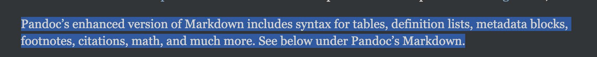
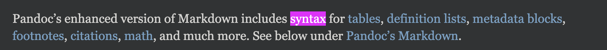

# Examples


## HTML sentence with embedded links 

This section will use a real life exammple


1) The user opens a web page: 
```html
<a href="https://pandoc.org/MANUAL.html">pandoc.org: Manual</a>
```

2) The user selects / highlights some of the page's content:
```html
<p>Pandoc’s enhanced version of Markdown includes syntax for <a href="#tables">tables</a>, <a href="#definition-lists">definition lists</a>, <a href="#metadata-blocks">metadata blocks</a>, <a href="#footnotes">footnotes</a>, <a href="#citations">citations</a>, <a href="#math">math</a>, and much more. See below under <a href="#pandocs-markdown">Pandoc’s Markdown</a>.</p>
```

### Input (HTML)

The input should be part of the page which the user has **selected** 

**Screenshot (selected / hightlighted)**


**Screenshot (NOT selected / hightlighted)**


**From HTML Source Code** 
```html
      <p>Pandoc’s enhanced version of Markdown includes syntax for <a
      href="#tables">tables</a>, <a href="#definition-lists">definition
      lists</a>, <a href="#metadata-blocks">metadata blocks</a>, <a
      href="#footnotes">footnotes</a>, <a
      href="#citations">citations</a>, <a href="#math">math</a>, and
      much more. See below under <a href="#pandocs-markdown">Pandoc’s
      Markdown</a>.</p>
``` 


### Pre-processing
No matter the output language, the input HTML will need some pre-processing before translating to other languages


#### Format for English Readability (not HTML readablity)
Often HTML comes formatted for readablity by programmers. We need to format so that its meant to be readabe by humans. 
We need to add and/or remove whitepace characters (such as formatter indenting, formatter newlines, etc...)


**Preprocessor Input: From Page Source Code** 
```html
<p>Pandoc’s enhanced version of Markdown includes syntax for <a
href="#tables">tables</a>, <a href="#definition-lists">definition
lists</a>, <a href="#metadata-blocks">metadata blocks</a>, <a
href="#footnotes">footnotes</a>, <a
href="#citations">citations</a>, <a href="#math">math</a>, and
much more. See below under <a href="#pandocs-markdown">Pandoc’s
Markdown</a>.</p>
```


**Preprocessor Output: Formatted as a readable sentence**
```html
<p>Pandoc’s enhanced version of Markdown includes syntax for <a href="#tables">tables</a>, <a href="#definition-lists">definition lists</a>, <a href="#metadata-blocks">metadata blocks</a>, <a href="#footnotes">footnotes</a>, <a href="#citations">citations</a>, <a href="#math">math</a>, and much more. See below under <a href="#pandocs-markdown">Pandoc’s Markdown</a>.</p>
```

!!! attention <!--title-->
    Contrary to the example above, other HTML elements might need a trailing newline ADDED as part of the preprocessor step. 
    EX: `<table>`, `<tr>`, etc.... Each `<tr>` will become a row of a markdown table, etc...
    EX: In markdown, lists usually need an empty line separating the previous element and the list (root level only however). I suppose this would map to `<ol>`, `<ul>`, etc...


!!! note
    This step only adds or removes whitespace

#### Relative urls -> Absolute urls
* Obviously if we paste relative/page anchors into an unrelated markdown (or html) document, it will try to link within that same destination document
* `markdown_linker` will need to prepend the page.url to the `href` value: 
 * EX: `href="#tables"` -> `href="${document.URL}#tables"` = `href="https://pandoc.org/MANUAL.html#tables"`
   * `document.URL` = `https://pandoc.org/MANUAL.html`
 * EX: From a different web page: `https://daringfireball.net/projects/markdown/syntax`
   * `document.URL` = `https://daringfireball.net/projects/markdown/syntax`
   * `<a href="#link">Links</a>` -> `<a href="https://daringfireball.net/projects/markdown/syntax#link">Links</a>`


### Converting to Markdown

#### HTML Elements to Markdown Elements
Probably easiest to:
* Make a list of basic HTML elements that we want to support. These will fall into two categories:
  * Okay to use directly in markdown. 
    * Some HTML elements are supported in CommonMarkdown. Some are even preferred.
      * EX: `` lets you control the image size
  * Needs to be converted to markdown
    * Write some basic conversion rules / regex to convert to our desired markdown


#### Additional Conversions

!!! note <!--title-->
    I'm not sure where this step shoudl be placed relative to the others. 
    Leaving it up to AI Agents to figure out the optimal sequencing


* Sometimes our working output might still require additional conversions. 

##### HTML -> HTML
* EX: `<b>` -> `<strong>`
  * We could deal with this by either:
    1) Convert each HTML to markdown like so
      * `<b>${content}</b>` -> `**${text}**`
      * `<strong>${content}</strong>` -> `**${text}**`
    2) Convert the element opener and closer to markdown
      * `</?(b|strong)>` -> `**`
    3) Convert HTML to preferred HTML, then to markdown
      * `<(/?)b>` -> `<$1strong>`, `<(/?)strong>` -> `**`
* EX: `<(/?)i>` -> `<$1em>`
* TODO: identify others

##### MARKDOWN -> MARKDOWN
* This could be replacing inline markdown links (`[]()`) with GitHub Markdown's Footnote Syntax


### Generate Additional Content

* 


### Outputs

```html
<p>Pandoc’s enhanced version of Markdown includes syntax for 
  <a href="#tables">tables</a>, 
  <a href="#definition-lists">definition lists</a>, 
  <a href="#metadata-blocks">metadata blocks</a>, 
  <a href="#footnotes">footnotes</a>, 
  <a href="#citations">citations</a>, 
  <a href="#math">math</a>, and much more. See below under 
  <a href="#pandocs-markdown">Pandoc’s Markdown</a>.
</p>
```

<p>Pandoc’s enhanced version of Markdown includes syntax for 
  <a href="#tables">tables</a>, 
  <a href="#definition-lists">definition lists</a>, 
  <a href="#metadata-blocks">metadata blocks</a>, 
  <a href="#footnotes">footnotes</a>, 
  <a href="#citations">citations</a>, 
  <a href="#math">math</a>, and much more. See below under 
  <a href="#pandocs-markdown">Pandoc’s Markdown</a>.
</p>

### Output (Markdown)

````markdown
Pandoc’s enhanced version of Markdown includes syntax for [Tables](https://pandoc.org/MANUAL.html#tables#tables), [Definition Lists](https://pandoc.org/MANUAL.html#tables#definition-lists), [Metadata Blocks](https://pandoc.org/MANUAL.html#tables#metadata-blocks), [Footnotes](https://pandoc.org/MANUAL.html#tables#footnotes), [Citations](https://pandoc.org/MANUAL.html#tables#citations), [Math](https://pandoc.org/MANUAL.html#tables#math), and much more. See below under [Pandocs Markdown](https://pandoc.org/MANUAL.html#tables#pandocs-markdown).
````

Pandoc’s enhanced version of Markdown includes syntax for [Tables](https://pandoc.org/MANUAL.html#tables#tables), [Definition Lists](https://pandoc.org/MANUAL.html#tables#definition-lists), [Metadata Blocks](https://pandoc.org/MANUAL.html#tables#metadata-blocks), [Footnotes](https://pandoc.org/MANUAL.html#tables#footnotes), [Citations](https://pandoc.org/MANUAL.html#tables#citations), [Math](https://pandoc.org/MANUAL.html#tables#math), and much more. See below under [Pandocs Markdown](https://pandoc.org/MANUAL.html#tables#pandocs-markdown).


---

# Conversion Examples

## HTML -> Markdown


```html
<ul id="ProjectSubmenu">
    <li><a href="/projects/markdown/" title="Markdown Project Page">Main</a></li>
    <li><a href="/projects/markdown/basics" title="Markdown Basics">Basics</a></li>
    <li><a href="/projects/markdown/syntax" title="Markdown Syntax Documentation">Syntax</a></li>
    <li><a href="/projects/markdown/license" title="Pricing and License Information">License</a></li>
    <li><a href="/projects/markdown/dingus" title="Online Markdown Web Form">Dingus</a></li>
</ul>
```


```html
<!-- 
  document.URL: "https://www.w3schools.com/html"
  source_url: "view-source:https://www.w3schools.com/html/html_elements.asp"
-->
<a target="_top" href="html_elements.asp">HTML Elements</a>
<div class="tut_overview">
  <a target="_top" href="html_elements.asp">Elements</a>
  <a target="_top" href="html_exercise_embed.asp?topic=elements" class="step_link no-checkmark">Exercises</a>
  <a target="_top" href="html_challenges_elements.asp">Code Challenge</a>
</div>
p
```


* `<ul.*>` -> remove
* `</ul>` -> remove
* `<a href="([\S])" title="" alt="">value</a>`
  * `markdown_link.url` = `html.a.href`
  * `markdown_link.title` = `html.a.value`
* `([ ]*)<li>(.*)</li>` -> `$1* $2`


````markdown
* [Main](https://daringfireball.net/projects/markdown/ "Markdown Project Page")
* [Basics](https://daringfireball.net/projects/markdown/basics "Markdown Basics")
* [Syntax](https://daringfireball.net/projects/markdown/syntax "Markdown Syntax Documentation")
* [License](https://daringfireball.net/projects/markdown/license "Pricing and License Information")
* [Dingus](https://daringfireball.net/projects/markdown/dingus "Online Markdown Web Form")
````
I dont' think Markdown has any sort of element like this. Maybe a single row table with no title row, containing links


