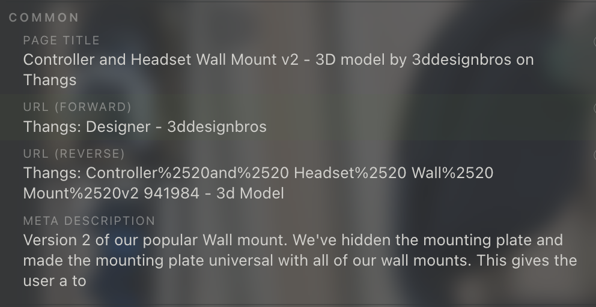

# New link formats for "common" section

* Currenlty the popup menu has a "common" section which contains 4 link format style:
  * 
  * image:   
  * image: 
  * image: 
  * image: 
  * image: 
* [▷ Markdown Links Syntax - Tutorial](https://htmlmarkdown.com/syntax/markdown-links/)
* [▷ Markdown Links Syntax - Tutorial](https://htmlmarkdown.com/syntax/markdown-links/)
* [▷ Markdown Links Syntax - Tutorial](https://htmlmarkdown.com/syntax/markdown-links/)
* [▷ Markdown Links Syntax - Tutorial](https://htmlmarkdown.com/syntax/markdown-links/)
* [▷ Markdown Links Syntax - Tutorial](https://htmlmarkdown.com/syntax/markdown-links/)
* [▷ Markdown Links Syntax - Tutorial](https://htmlmarkdown.com/syntax/markdown-links/)