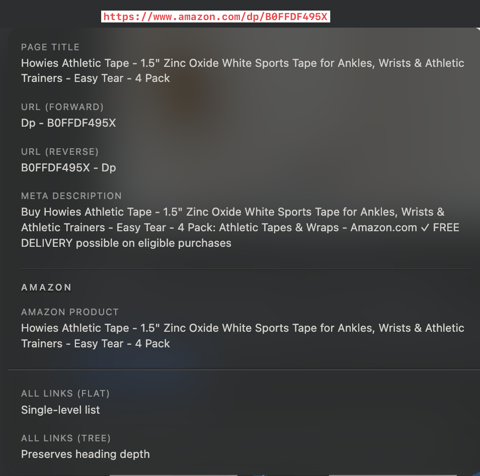
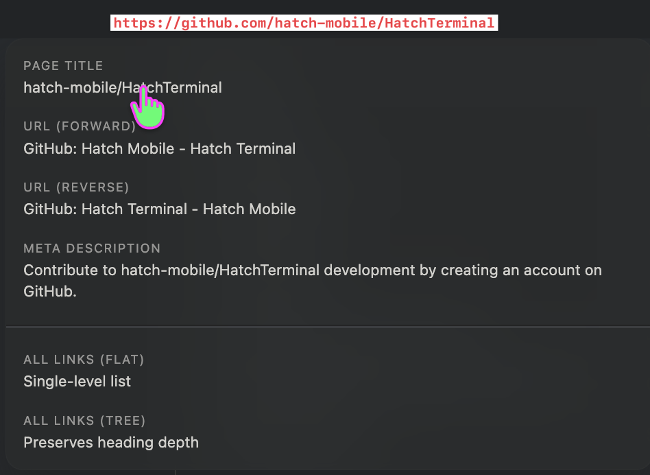
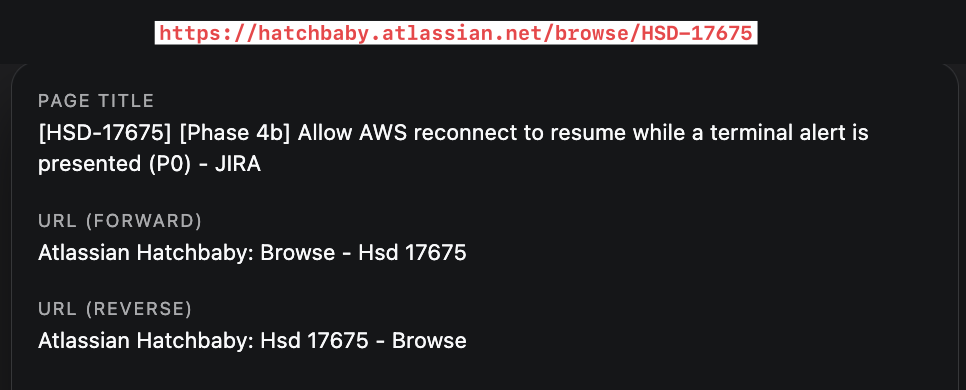
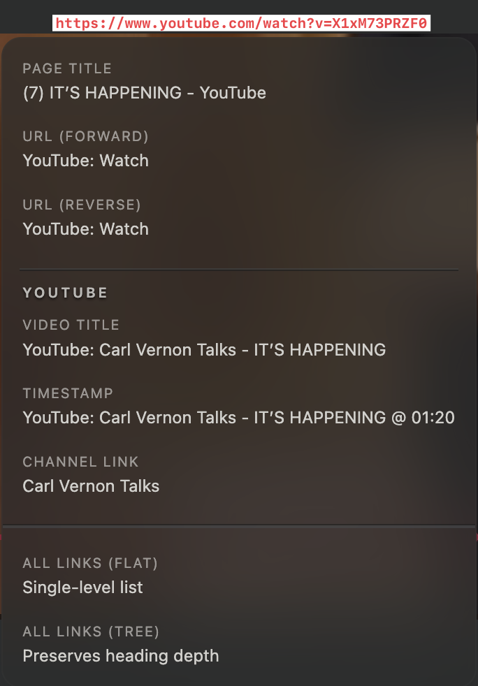
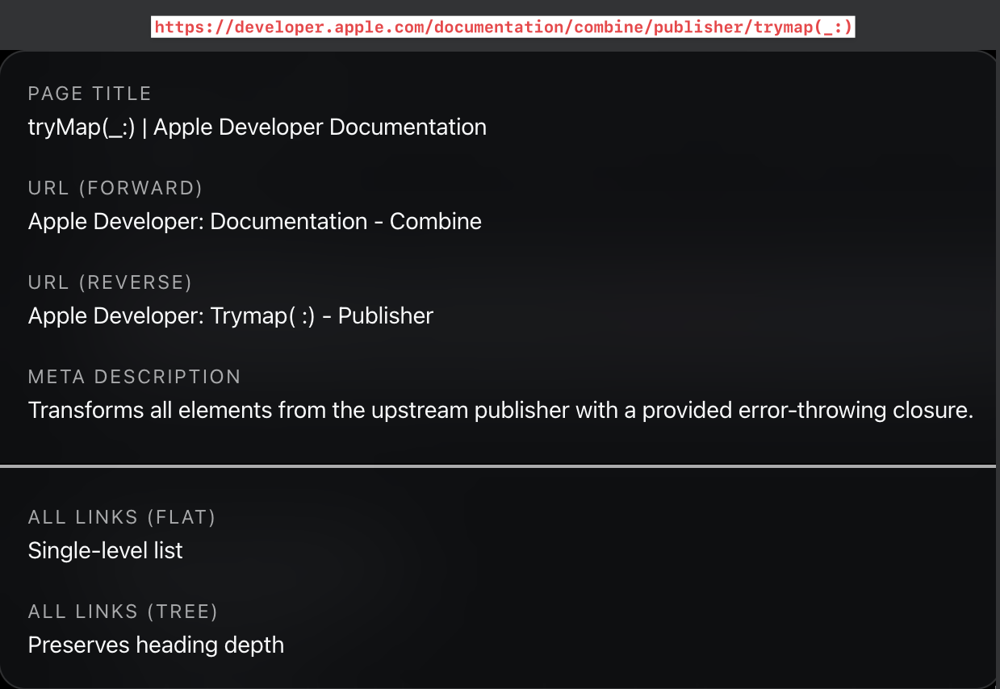

# Youtube

* Timestamp links should be in `mm:ss` for the link title and the link's URL
* Youtube does support a minutes seconds format
* EX of current: [YouTube: TornadoTRX - Pilger - The Most Insane Day In Tornado History @ 09:15](https://youtu.be/nw9d7s7Hz38?t=555)
    * the title has it right (9:15), but the url is is using seconds only (`t=555`)
* These urls all seems to work:
  * `https://youtu.be/nw9d7s7Hz38?t=545`
  * `https://youtu.be/nw9d7s7Hz38?t=9m5s`
  * `https://youtu.be/nw9d7s7Hz38?t=09m05s`

[YouTube: TornadoTRX - Pilger - The Most Insane Day In Tornado History @ 09:15](https://youtu.be/nw9d7s7Hz38?t=555)

---

# Redefine the formats and variants of link.title

* `[${url.hostname}: $(extractPageTitle)](${url})`

# Screenshots of Current Link Titles
*  
* 
* 
* 
* 

## title format rules

* Avoid using `[`, `]`, `(`, `)` in the link titles.

!!! info 
    We are building a `markdown` link which uses `[`, `]`, `(`, `)` in the syntax. 
    Some IDEs, renderers, services, etc... can become confused while trying to parse such links

## Common (across all domains)

## Unique (per domain) - aka "Domain Specific"
* Domain specific computation (of link.title) is currently supported only for a few domains.
  * I believe it's `amazon.com` and `youtube.com` 
  * There are many more that I'd like to add
  * Up until now
* In order to better support domain specific link.title formatting, I think we need to figure out how to express those rules using something like JSON5 files. 

### github .com
* [[HSD-17570] Reset reconnect backoff sooner: tune V3 MQTT auto-reconnect config by zakkhoyt · Pull Request #2794 · hatch-baby/mobile](https://github.com/hatch-baby/mobile/pull/2794)

### apple docs
* [tryMap(_:) | Apple Developer Documentation](https://developer.apple.com/documentation/combine/publisher/trymap(_:))

