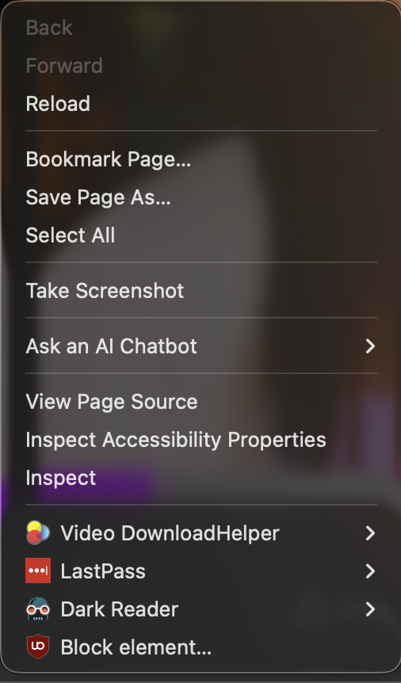
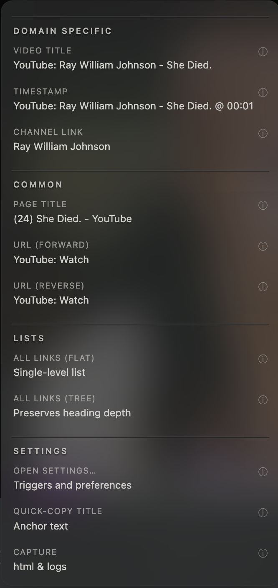
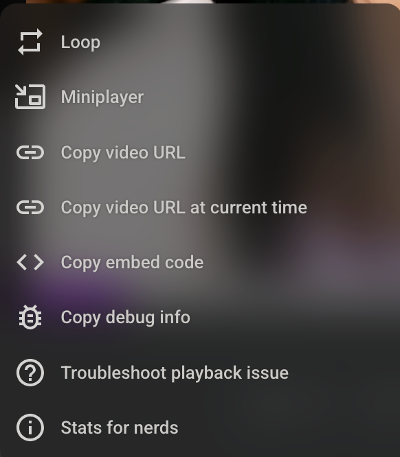

  <!-- 
  # Popup menu appearance
  * Let's make some changes to the appearance of the popu menu
  * I'd like the appearanch to be more like Firefox's
  * Now our menu items do have more UI controls vs Firefoxes and will be larger because of it, but there are still some changes we can make:
    * Slightly larger font
    * More compact layout (less empty space)
    * Separation lines should be lighter in color (for a dark appearance mode)
      * Our popup menu is using 2 lines together. A dark and a light line. No need for this. 
    * Less blur in the background. Our background is too blurry and has too light of a tint to the blur. Try to match firefox's settings
  * Indenting - all labels seem to have the same x postion value. 
    * this makes it hard to see the hierarchy. 
      * EX: section title label is the same x postion as the title/text of all of it's children
    * We should add some indenting to these labels
      * Think of it like this: menu_section.title > menu_cell.title > menu_cell.text  
    
  * Here are some screenshots comparing menus
    *  
    *  
    * 
 -->


# Add a new preference and UI controls in the custom Settings GUI
* `verbose_menus: Bool`
  * default value: false

## Settings GUI Bug
!!! bug 
    I noticed that when "toggling" preferences in our custom Settings UI, that the label values to do not update. 
    It is necessary to close the settings panel then reopen it to see the changes. `


# Update Popup Menu Appearance based on the value of `verbose_menus`
* When `verbose_menus=false`, render the popup menu just like it is currenlty being rendered
* when `verbose_menus=true`, I want the menu to render and behave differently (morew like a traditional hierarchical context menu system, like Firefox's context click menu system) 
  * a smaller & more compact version
  * Each level of depth in the menu hierarchy will pop up in sequence. IE:
    * only the root level (depth 1) will render at first. 
    * For each menu_item in that root level that contains chilredn, a trailing `>` will be included to visually indicate it. 
    * As the user mouse hovers over the menu_items, the background will be changed to the system selection color
      * Hopfully this is available via API. It's a greenish color in my screenshots
    * As the user mouse hovers over a menu_item which contains more children:
      * The child items will pop out as a submenu on that initial section (and so on)
    * if the user mouse hovers over a leaf node
  * each menu_cell will only display the `title` propertry
  * There will be a second icon (next to the tooltips icon), which behaves exactly the same way, but displays the value of the `text` property (which is the link title)

Here is an example screenshot that I captrued from firefox' context menu:


* This version of the menu should also render/use the nesting defined in `docs/ai/planning/markdown_linker/menus/PLANNING_MARKDOWN-LINKER-CONTEXT-MENU_PHASE-01.json5`

* IE you would only see the level 1 items at first (the `--- TITLE ---` items in this example)


## Example 1
```menu
* "--- DOMAIN SPECIFIC ---"
    * "VIDEO TITLE"
    * "TIMESTAMP"
    * "PLAYLIST MARKDOWN"
    * "PLAYLIST LINK"
    * "CHANNEL LINK"
* "--- COMMMON ---"
    * "PAGE TITLE"
    * "URL (FORWARD)"
    * "URL (REVERSE)"
* "--- LISTS ---"
    * "TREE LIST: ALL LINKS"
    * "FLAT LIST: ALL LINKS"
    * "DEBUG"
* "--- PAGE ---"
    * "ALL LINKS"
    * "ALL LINKS (FLAT)"
* "--- SETTINGS ---"
    * "APP SETTINGS"
* "--- DEVELOPER ---"
    * "ALL LINK VARIANTS"
```

## Example 2

I would expect 3 levels of depth with a definition like this
```menu
* "--- DOMAIN SPECIFIC ---"
    * "VIDEO TITLE"
    * "TIMESTAMP"
    * "PLAYLIST MARKDOWN"
    * "PLAYLIST LINK"
    * "CHANNEL LINK"
* "--- COMMMON ---"
    * "--- COMMON (BASED ON PAGE HTML) --- "
      * "PAGE TITLE"
    * "--- COMMON (BASED ON URL PATH) --- "
      * "URL.PATH (FORWARD)"
      * "URL.PATH (REVERSE)"
    * "--- COMMON (BASED ON QUERY PARAMS) --- "
      * "URL.QUERY_PARAMS"
* "--- LISTS ---"
    * "TREE LIST: ALL LINKS"
    * "FLAT LIST: ALL LINKS"
    * "DEBUG"
* "--- PAGE ---"
    * "ALL LINKS"
    * "ALL LINKS (FLAT)"
* "--- SETTINGS ---"
    * "APP SETTINGS"
* "--- DEVELOPER ---"
    * "ALL LINK VARIANTS",
```


# Violentmonkey preferences (In the VM menu)
  * I think we can shorten the settings menu section to show the custom UI form. 
    * All settings should be accessible on there anyhow