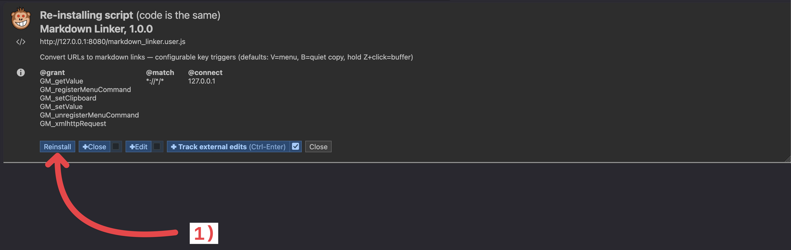
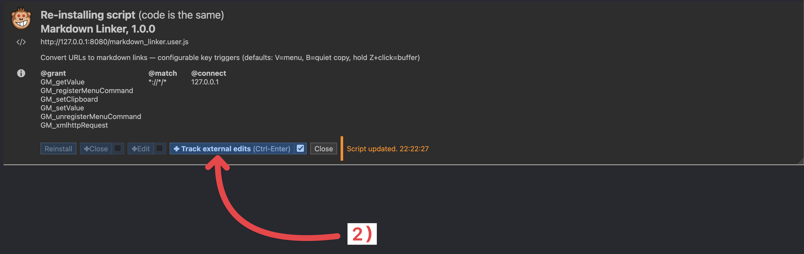
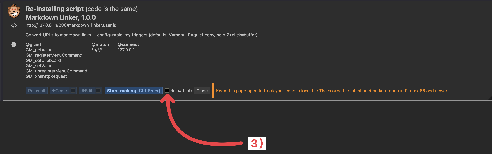
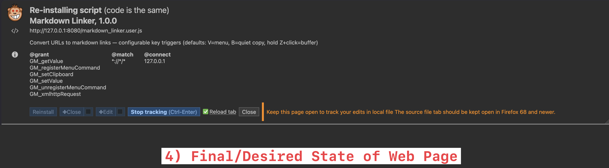

# Bundler & `#dev-open` directives
* A while ago (before we started using the `bundler`), we had added a mechanism to get `violentmonkey.zsh` to open some websites in browser tabs
* This is a useful debugging feature
* When we added the `bundler` step, this feature broke. `
* It seems that bundler sanitzes the code to a certain degree, and ends up stripping out `#dev-open` comments
  * From violentmonkey.zsh logs: `[INFO] ℹ️ No #dev-open directives found in script`
* I'd prefer all comments to be retained if possible. 
  * perhaps we can control this with a `--build-mode <mode>` argument (on `scripts/userscript/scaffold_userscript_project.zsh`?)
    * `mode=debug`: retain all comments, code formatting, etc... so that it matches the sources helping to debug. 
      * default value when omitted
    * `mode=release`: optimize for release to the public, performance, small script byte size, etc...
    

# violentmonkey.zsh

* This script stars a server which launches a custom UI in firefox
  * URL: http://127.0.0.1:8080/markdown_linker.user.js
  * URL: `moz-extension://b68598bc-6d21-49fc-9e0d-d48d81efc623/confirm/index.html#VM1m9548qbgeb`
* This UI has some controls that I always have to manually intract with. 
  * Here are some screenshots I took and anotated with markup (order dependent)
    * 
    * 
    * 
    * 
  * Perhaps we can use query parameters to arm these controls? Or some way to do that?
    * look at the source code for that page, it should exist on disk somewhere
    * consult official documentation and forums as well. 
  * The most important is to get it to `reinstall` 
  * 2nd most important is to pre-enable the refresh on source edit

## Revisit stderr
* this script has undergone some changes over time. I just want to make sure the stderr/stdout is accurate
* be specific. The current logs say things like: `[violentmonkey] Edit markdown_linker.user.js using whatever you like`
  * this is frustrating. Which `markdown_linker.user.js`? 
    * ANSI escape code support a "link" type markup.
      * our `zsh` scripts use `slog_*` functions to write to stdout/stderr using ANSI escape codes. 
      * `slog_*` use a tool named `echo_pretty` which is a lot like `echo` but with modern syntax for the ANSI stuff
      * I'm not sure if `echo_pretty` currently support link syntax yet.
        * NOTE: `echo_pretty` does support `--url`, but this just applies cyan/underline to the text. It does not support separate `title` & `url` fields
    * See: 
    * See: `/Users/zakkhoyt/code/repositories/hatch/hatch_mobile/HatchTerminal/Sources/ANSIUtilities/ANSIUtilities.docc/**/*`

# efficiency
* Please revisit both `violentmonkey.zsh` and `source_capture_server.zsh` 
  * both of these launch HTML servers
  * both should check if any of their respectiv3 servers are already running (IE from another terminal instance, etc...)
    * If so, kill those instances before bringing up a new one
  * Follow `zsh` conventions outlined in AI rules/instructions 
    * esp `slog_step_*` 

# Wrapper script
* It is very common that after AI agents finish some work that I test the code out:
  * open a new terminal tab
    * cd to repo root
    * `./scripts/violentmonkey/violentmonkey.zsh --script markdown_linker/markdown_linker.user.js --debug`
      * this script runs indefinitely. It keeps the server open until terminated, then exits. 
  * open a new terminal tab
    * cd to repo root
    * ` ./scripts/source_capture/source_capture_server.zsh --debug`
      * this script runs indefinitely. It keeps the server open until terminated, then exits. 
* As you can see this takes two terminal tabs and is a bit tedious
* Can we create a wrapper script that:
  * manages tabs internally using tmux, screen, etc...
  * runs both scripts
    * violentmonkey on the left
    * source capture on the right
  * when wrapper script exits, properly end both script executions
    * Extract 
* Create a link to the new script in the repo root
