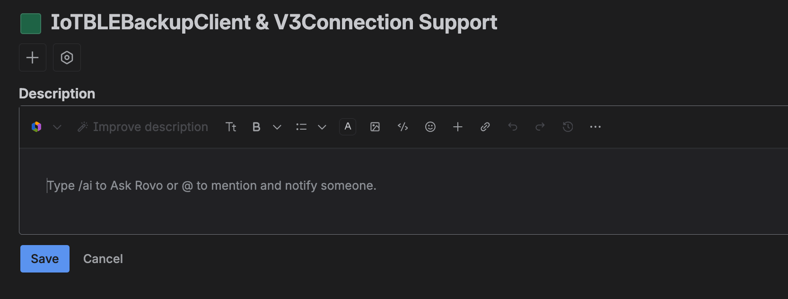

# Jira ADF <--> Markdown
* It's a real pain to use any sort of text formatting in Jira issues. 
* Bing a markdown guy I would LOVE to be able to paste markdown into a Jire issue and have it render/work. 
* Instead it seems like it's even more work pasting markdown because Jira seems to accept some thing and not others. Even of the same type. 
* We could modify jira's text editor
  * Add an additional control to the existing toolbar
    * Perhaps a toggle titled `markdown-mode` (text: `markdown`)
  * When `markdown-mode` is active 
    * the other controls would be disabled (maybe later they could but adapted to work with `markdown` too)
    * Pressing `Save` would first convert the entered text from `markdown` to `ADF` format, then post it thorugh the API 

